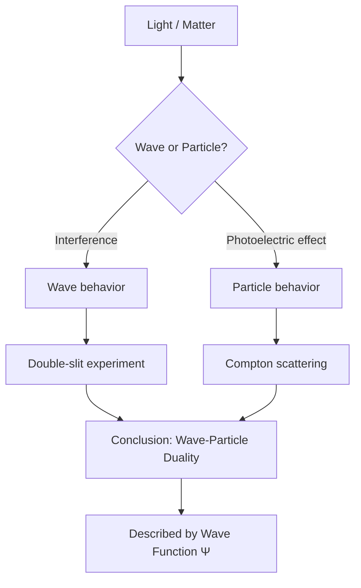
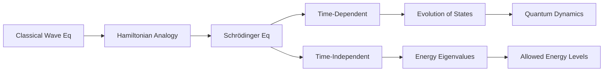
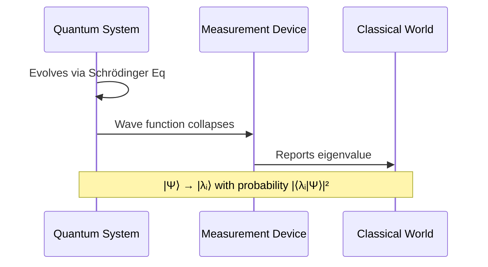
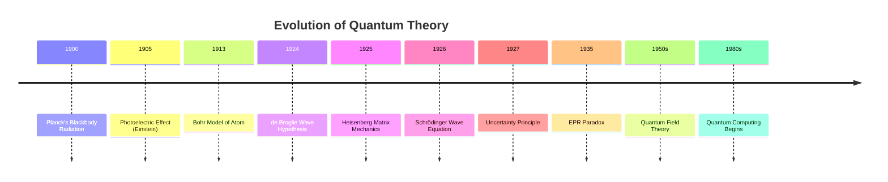
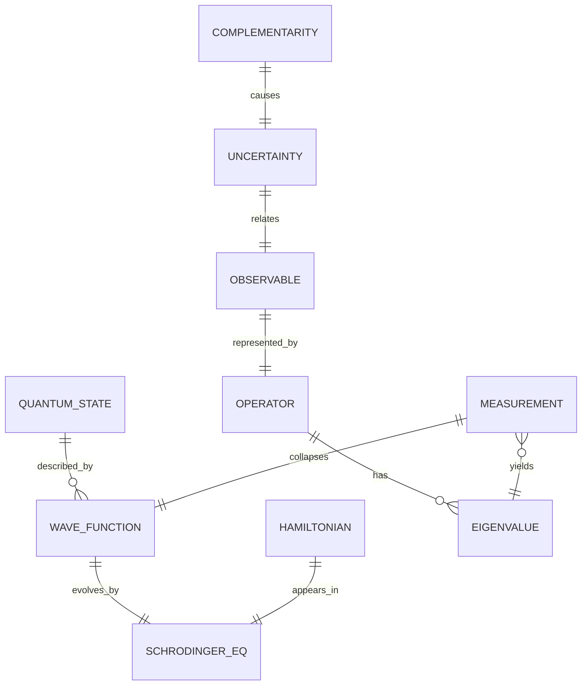
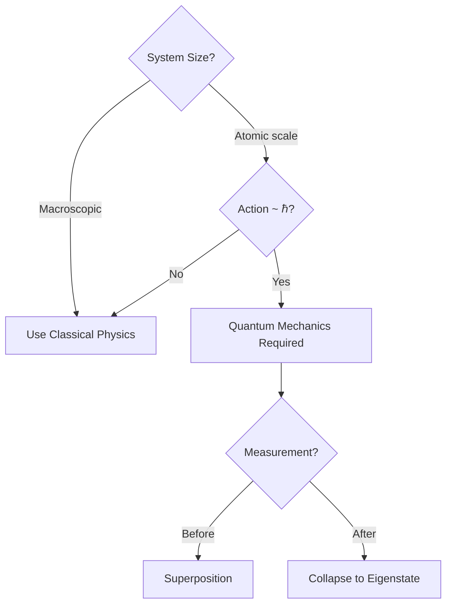
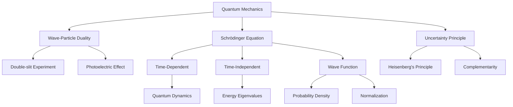
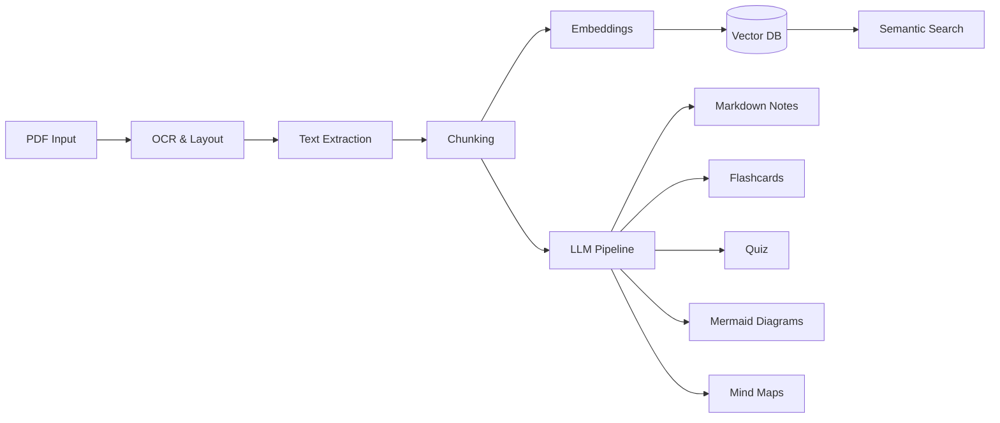
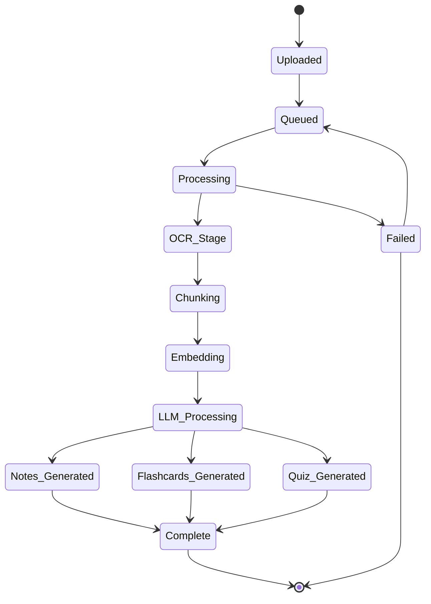
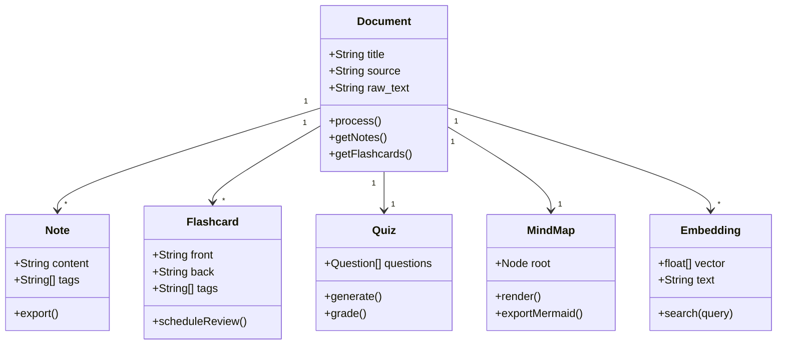

# Phase 11-12: Markdown Design & Mermaid Diagrams

## Markdown Output Template (AI-Generated)

When a document is processed, the system produces the following Markdown structure:

```markdown
---
title: "Quantum Mechanics: An Introduction"
source: "quantum_mechanics_textbook.pdf"
author: "Griffiths, David J."
pages: 24
processed: "2026-07-03"
tags: [physics, quantum, wave-mechanics]
difficulty: advanced
language: english
model: llama-3.2-1b
license: CC-BY-SA
---

# Quantum Mechanics: An Introduction

> **TL;DR:** A comprehensive introduction to quantum mechanics covering
> wave-particle duality, the Schrödinger equation, quantum operators,
> and the uncertainty principle. The document explains how quantum
> mechanics describes nature at atomic scales through mathematical
> formalisms and experimental evidence.

---

## Overview

Quantum mechanics is the fundamental theory describing the physical
properties of nature at the scale of atoms and subatomic particles.
It introduces concepts that challenge classical intuition, including:

- **Wave-particle duality**: Particles exhibit both wave-like and
  particle-like behavior
- **Quantization**: Physical quantities take discrete values
- **Superposition**: Systems exist in multiple states simultaneously
- **Uncertainty**: Precision limits on complementary measurements

---

## Key Definitions

### Wave Function (Ψ)
A mathematical description of the quantum state of a system. The
probability of finding a particle in a given location is |Ψ|².

### Hamiltonian (Ĥ)
The operator representing the total energy of the system.

### Eigenstate
A state that yields a definite value (eigenvalue) when measured
for a particular observable.

---

## Important Formulas

### Schrödinger Equation (Time-Dependent)
$$
i\hbar\frac{\partial}{\partial t}|\Psi(t)\rangle = \hat{H}|\Psi(t)\rangle
$$

### Schrödinger Equation (Time-Independent)
$$
\hat{H}|\Psi\rangle = E|\Psi\rangle
$$

### de Broglie Wavelength
$$
\lambda = \frac{h}{p}
$$

### Heisenberg Uncertainty Principle
$$
\Delta x \Delta p \geq \frac{\hbar}{2}
$$

---

## Diagrams

### Wave-Particle Duality Overview



### The Schrödinger Equation



### Quantum Measurement Process



### Timeline: Development of Quantum Mechanics



### Entity Relationship: Quantum Concepts



### Decision Tree: Quantum vs Classical Regime



---

## Examples

### Example 1: Particle in a Box

A particle of mass m is confined to a 1D box of length L.

**Solution:**
The wave function is:
$$
\psi_n(x) = \sqrt{\frac{2}{L}} \sin\left(\frac{n\pi x}{L}\right)
$$

**Energy levels:**
$$
E_n = \frac{n^2\pi^2\hbar^2}{2mL^2}
$$

### Example 2: Tunneling Effect

A particle with energy E encounters a barrier of height V₀ > E.

The particle can tunnel through with probability:
$$
T \approx e^{-2\kappa a}
$$
where $\kappa = \sqrt{2m(V_0-E)}/\hbar$

---

## Important Questions

1. Explain the physical interpretation of the wave function.
2. Derive the time-independent Schrödinger equation from the
   time-dependent form.
3. What is the significance of the Heisenberg Uncertainty Principle?
4. Compare and contrast the Copenhagen and Many-Worlds interpretations.
5. How does quantum tunneling enable technologies like scanning
   tunneling microscopy?

---

## Quiz

### Question 1
Which equation describes the time evolution of a quantum state?

A. Newton's Second Law
B. Maxwell's Equations
C. Schrödinger Equation ✓
D. Einstein's Field Equations

### Question 2
The de Broglie wavelength of a particle is inversely proportional to:

A. Its mass
B. Its momentum ✓
C. Its energy
D. Its charge

...

---

## Flashcards

### Card 1
**Front:** What is the Schrödinger equation?
**Back:** The fundamental equation of quantum mechanics describing how
the quantum state of a system evolves over time.
$$i\hbar\frac{\partial}{\partial t}|\Psi\rangle = \hat{H}|\Psi\rangle$$
**Tags:** #quantum #core-equation #schrodinger

### Card 2
**Front:** State the Heisenberg Uncertainty Principle.
**Back:** It is impossible to simultaneously know both the exact
position and exact momentum of a particle.
$$\Delta x \Delta p \geq \frac{\hbar}{2}$$
**Tags:** #quantum #uncertainty #heisenberg

---

## Learning Progress

- [x] Wave-Particle Duality
- [x] Wave Function
- [x] Schrödinger Equation
- [ ] Quantum Operators
- [ ] Measurement Theory
- [ ] Applications

---

## References

- Chapter 1, "The Wave Function" (p. 1-24)
- Chapter 2, "Time-Independent Schrödinger Equation" (p. 25-67)
- Feynman Lectures, Vol. 3, Chapter 1

---

## Tags

`#quantum-mechanics` `#physics` `#wave-function` `#schrodinger`
`#heisenberg` `#wave-particle-duality` `#advanced`
```

---

## Additional Mermaid Diagram Types

### Knowledge Graph



### Architecture Flow



### State Diagram: Document Processing States



### Gantt: Typical Processing Timeline

```mermaid
gantt
    title Document Processing (100-page PDF)
    dateFormat  X
    axisFormat %s
    section Preprocessing
    OCR & Layout         : 0, 15s
    Text Extraction      : 5s, 10s
    section AI Pipeline
    Chunking             : 10s, 12s
    Embeddings           : 12s, 25s
    LLM Summary          : 25s, 50s
    section Generation
    Notes                : 50s, 60s
    Flashcards           : 55s, 65s
    Quiz                 : 60s, 70s
    Mind Map            : 60s, 68s
```

### Class Diagram: Knowledge Structure


